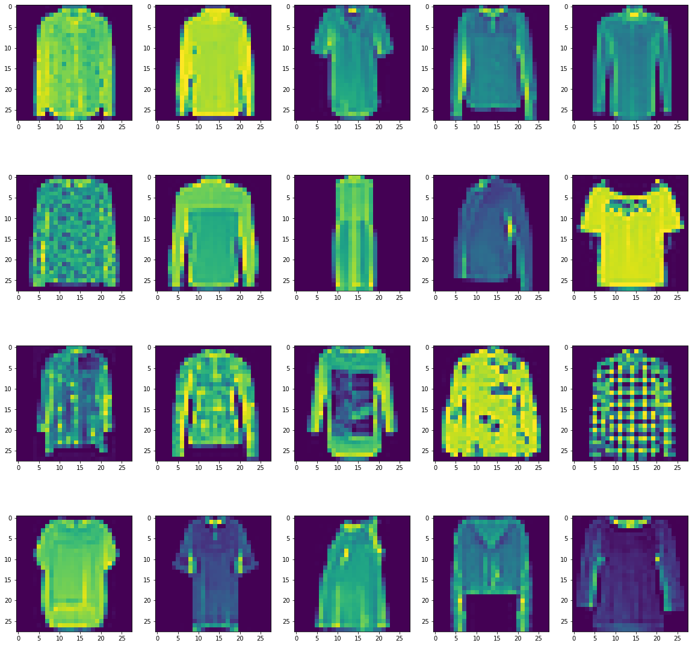

# Neural Network - Fashion MNIST 👗👔

## Problem Statement

Fashion-MNIST is a dataset of Zalando's article images—consisting of a training set of 60,000 images. Each image has a dimension of 28x28 pixels and associated with a label from 10 classes. The value associated to each pixel, in range of 0 to 255, indicates its level of lightness or darkness. The purpose of this project is to train a deep neural network model by the training dataset and evaluates its performance on labeling correctly the fashion classes in the test set.

## Dataset

- Each row is a separate image
- Column "label" is the class label.
- Remaining columns are pixel numbers (784 total).
- Each value is the darkness of the pixel (0 to 255)

Each training image is assigned to one of the following labels:

|Class|Label|
|:---:|:---:|
|T-shirt/top|0|
|Trouser|1|
|Pullover|2|
|Dress|3|
|Coat|4|
|Sandal|5|
|Shirt|6|
|Sneaker|7|
|Bag|8|
|Ankle boot|9|

## Workflow

1. Importing dataset from the data folder and investigating it for any missing values
2. Performing data EDA
3. Transforming target variable from a vector to a matrix
4. Splitting data into train and test sets
5. Using deep learning to train the model and evaluate its performance on the test set using a classification report

## Results

During the iterative process of training the model, it was realized that a combination of regularization and early stopping helps to improve the overall model accuracy. Below shows the model performance on the training and test sets after 49 epochs. 

<figure>
    

</figure> 

The classification report, showed below, indicates that the Shirt class has the lowest f1-score. A deeper investigation into it suggests that some of the images in this class have missing parts or they don't have a high-quality image. These can lead to lower scores compared to other classes.

<figure>
    

</figure> 
<figure>
    

</figure> 

## Reference

[Dataset from Kaggle](https://www.kaggle.com/zalando-research/fashionmnist)

## Disclaimer

Since the GitHub doesn't allow to upload files with a size more than 100 MB, please open the Kaggle link in the reference section to get access to the dataset used in this project.